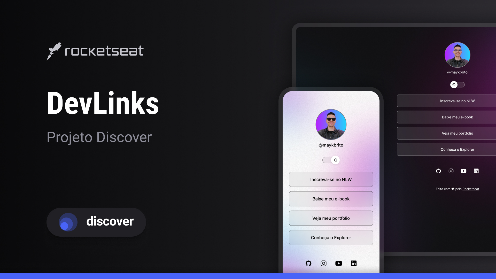

<h1 align="center">DevLinks </h1>

programa exclusivo e gratuito, promovido pela Rocketseat para ensino de tecnologias WEB.

  <a href="#-tecnologias">Tecnologias</a>&nbsp;&nbsp;&nbsp;|&nbsp;&nbsp;&nbsp;
  <a href="#-projeto">Projeto</a>&nbsp;&nbsp;&nbsp;|&nbsp;&nbsp;&nbsp;
  <a href="#-layout">Layout</a>&nbsp;&nbsp;&nbsp;|&nbsp;&nbsp;&nbsp;
  <a href="#-licença">Licença</a>

  

 

  
  

## 🤖 Tecnologias

Esse projeto foi desenvolvido com as seguintes tecnologias:

- HTML e CSS
- JavaScript
- Git e Github
- Figma

## 💻 Projeto

o DevLinks e um agregador de links para usar como cartao de visitas online.

## 📎 Layout

Você pode visualizar o layout do projeto através [DESSE LINK](https://www.figma.com/file/mf894tdzm99fg9ssu4kymq/DevLinks-(copy)?node-id=1%3a113&t=8x94o7ectaqmc2cs-1/duplicate). É necessário ter conta no [Figma](https://figma.com) para acessá-lo.

## 📑 Licença

Esse projeto está sob a licença MIT.

👋 [Participe da nossa comunidade!](https://discord.gg/rocketseat)      
                                          
<<<<<<< HEAD
   Feito com ♥ Rocketseat.
=======
                                           Feito com ♥ Rocketseat.
>>>>>>> ae02f180b93c29c92de99106afa3ec6c8ac3d35a
